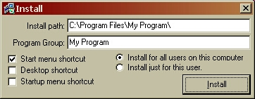



## Install/Uninstall

### Description

This will install and uninstall your vb program. All it requires it that the vb runtime dll be in the same folder as the compiled install.exe file. Just throw the runtime and all the ocx and dlls that your program uses into a folder, add a data.ini with the proper settings and the intall.exe and uninstall.exe into a folder and that is all you need. (Tuesday, June 10, 2003) UPDATE: It now adds your program to the 'Add-Remove Programs' list in the control panel.
 
### More Info
 

             |
---                |---
**Submitted On**   |2003-06-11 13:12:54
**By**             |[Jason Stracner](https://github.com/Planet-Source-Code/PSCIndex/blob/master/ByAuthor/jason-stracner.md)
**Level**          |Intermediate
**User Rating**    |4.7 (28 globes from 6 users)
**Compatibility**  |VB 6\.0
**Category**       |[Files/ File Controls/ Input/ Output](https://github.com/Planet-Source-Code/PSCIndex/blob/master/ByCategory/files-file-controls-input-output__1-3.md)
**World**          |[Visual Basic](https://github.com/Planet-Source-Code/PSCIndex/blob/master/ByWorld/visual-basic.md)
**Archive File**   |[Install\_Un1599906122003\.zip](https://github.com/Planet-Source-Code/jason-stracner-install-uninstall__1-46068/archive/master.zip)

